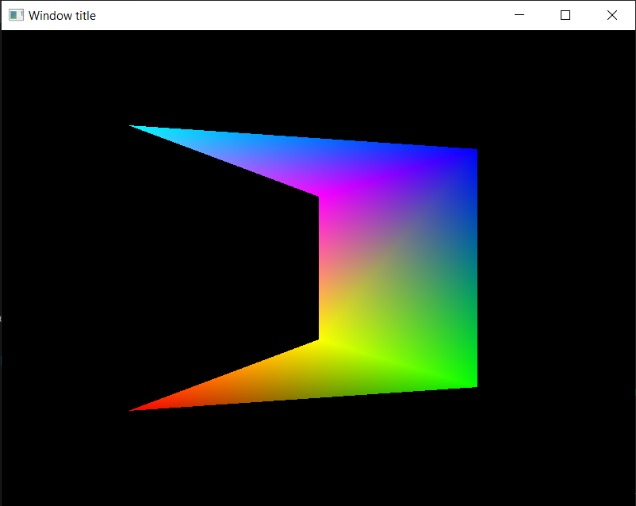

# Relatório do envio do trabalho

Nesta pasta estão os códigos usados para gerar a janela estática da imagem a seguir.

O código em si eu decidi tentar modularizar o quanto pude, fazendo a classe de polígono herdar de uma classe de shape mais rica do que a base provida pelo enunciado, que encapsula a grande maioria das chamadas da API do OpenGL de fato. Na main é onde está a definição do polígono estático.

Decidi também separar as funções que tratam os inputs do usuário em um arquivo dedicado, para reduzir o tamanho do arquivo main o máximo possível.

Os shaders em glsl estão escritos em arquivos dedicados também com o intuito de modularização.
